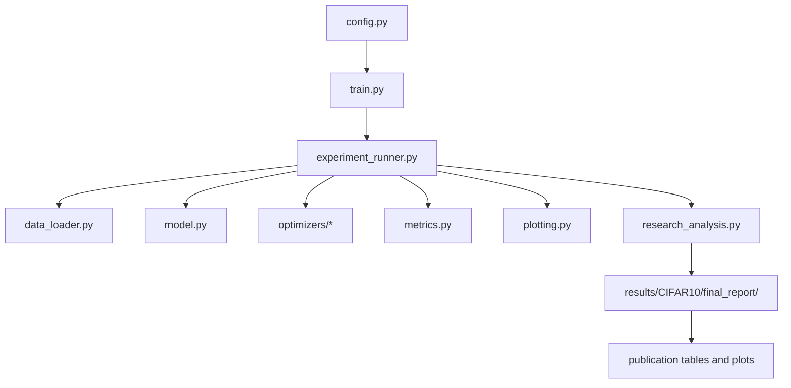

# CNN Hyperparameter Optimization Research Framework

Bu depo, CIFAR-10 üzerinde çalışan sabit HybridCNN mimarisini GWO, PSO, WOA ve RAO ile aynı deney koşullarında karşılaştırmak için tasarlanmış yayın odaklı bir araştırma çerçevesidir. Tek giriş noktası `python train.py` komutudur; bu komut deneyleri yürütür, çoklu-run çıktıları üretir, istatistiksel analizi tamamlar ve nihai araştırma raporunu otomatik oluşturur.

## Deney Tasarımı

Varsayılan kurulum çoklu-run’dur.

- `runs = 3`
- `population_size = 8`
- `iteration_count = 15`
- `search_epochs = 6`
- `final_epochs = 50`
- `random_seed = 42`

Her optimizer aynı veri setini, aynı train/validation/test ayrımını, aynı CNN mimarisini, aynı search space’i, aynı fitness fonksiyonunu, aynı eğitim prosedürünü ve aynı değerlendirme prosedürünü kullanır.

Her optimizer üç bağımsız seed ile çalıştırılır ve run çıktıları üzerine yazılmaz; yeni koşular `run_XX` dizinlerine eklenir.

## Proje Yapısı

- [config.py](config.py): merkezi deney konfigürasyonu, optimizer listesi ve search space.
- [train.py](train.py): tek komutluk ana giriş noktası.
- [experiment_runner.py](experiment_runner.py): optimizer döngüsü, veri yükleme, fitness değerlendirme, final eğitim, run-level raporlama ve nihai raporun tetiklenmesi.
- [research_analysis.py](research_analysis.py): Friedman testi, Wilcoxon testleri, hyperparameter landscape analizi, convergence/diversity/stability görselleştirmeleri ve final report üretimi.
- [analyze_results.py](analyze_results.py): legacy/manuel analiz aracı; ana akışta kullanılmaz.
- [data_loader.py](data_loader.py): dataset indirme, split ve DataLoader oluşturma.
- [model.py](model.py): sabit HybridCNN mimarisi.
- [metrics.py](metrics.py): eğitim ve değerlendirme metrikleri.
- [plotting.py](plotting.py): run-level görseller.
- [utils.py](utils.py): seed, logging, JSON ve dosya yardımcıları.
- [optimizers/](optimizers/): ortak arayüz ve GWO/PSO/WOA/RAO implementasyonları.
- [finalize_results.py](finalize_results.py): legacy sonuç yeniden oluşturma aracı.
- [plot_results.py](plot_results.py): legacy plotting uyumluluk dosyası.
- [gwo.py](gwo.py): legacy tek-algorithm GWO uygulaması.

## Çalışma Akışı



Akışın özeti:

1. `config.py` deney sabitlerini tanımlar.
2. `train.py` doğrudan `experiment_runner.main()` çağırır.
3. `experiment_runner.py` listedeki tüm optimizer’ları sırayla çalıştırır.
4. Her optimizer için `runs` kadar bağımsız seed türetilir.
5. Her run için veri seti yüklenir, candidate -> CNN -> kısa eğitim -> validation fitness -> optimizer update zinciri uygulanır.
6. En iyi çözümle final model yeniden eğitilir ve test değerlendirmesi yapılır.
7. Her run için `summary.json`, eğitim eğrileri, confusion matrix ve search history yazılır.
8. Tüm run’lar tamamlanınca `research_analysis.py` otomatik çağrılır.
9. Final report oluşturulur ve publication-ready tablolar / figürler üretilir.

## Tek Komutlu Çalıştırma

Ana deney komutu:

```bash
python train.py
```

İsteğe bağlı olarak tek bir optimizer seçilebilir:

```bash
python train.py --optimizer gwo
```

JSON config ile override:

```bash
python train.py --config my_config.json
```

## Run-Level Çıktılar

Her optimizer için yapı:

```text
results/CIFAR10/<ALGORITHM>/run_XX/
```

Her run klasöründe:

- `config_used.json`
- `summary.json`
- `search_history.csv`
- `best_model.pth`
- `global_best.png`
- `local_bests.png`
- `training_curves.png`
- `confusion_matrix.png`

`summary.json` aşağıdaki temel alanları içerir:

- best validation accuracy
- best test accuracy
- precision
- recall
- f1
- runtime_seconds
- best_hyperparameters
- convergence_history
- diversity_history
- exploration_history
- exploitation_history
- iteration_summaries
- package_versions

## Algorithm-Level Çıktılar

Her optimizer için:

```text
results/CIFAR10/<ALGORITHM>/summary.json
```

Bu dosya, tüm run’ları ve algoritma düzeyindeki ortalama / std özetlerini içerir.

## Final Research Report

Tüm deneyler tamamlandıktan sonra nihai yayın klasörü otomatik üretilir:

```text
results/CIFAR10/final_report/
```

Bu klasör, makale yazımına başlanacak ana üretim alanıdır.

Önemli içerikler:

- `overall_summary.json`
- `ranking_table.csv`
- `friedman_results.json`
- `wilcoxon_results.csv`
- `hyperparameter_summary.csv`
- `population_statistics.csv`
- `diversity_comparison.csv`
- `best_hyperparameters_all_runs.csv`
- `best_hyperparameters_per_algorithm.csv`
- `convergence_comparison.png`
- `mean_convergence_comparison.png`
- `diversity_comparison.png`
- `accuracy_boxplot.png`
- `f1_boxplot.png`
- `runtime_boxplot.png`
- `hyperparameter_analysis/`

### `hyperparameter_analysis/`

Bu alt klasör, bütün run’lardan toplanan en iyi hiperparametrelerin dağılım analizini içerir.

Beklenen içerik:

- her optimize edilmiş hiperparametre için histogram
- her optimize edilmiş hiperparametre için boxplot
- publication-oriented dağılım görselleri

## İstatistiksel ve Görsel Analizler

Final report otomatik olarak aşağıdaki analizleri üretir:

- Friedman testi, `test_accuracy` metriği üzerinden
- Wilcoxon signed-rank pairwise testleri
- mean convergence comparison
- per-optimizer multi-run convergence plots
- diversity evolution comparison
- stability boxplots
- hyperparameter landscape summary
- population statistics per iteration

## Veri ve Mimarinin Sabitliği

Karşılaştırma adilliği için aşağıdakiler tüm algoritmalarda aynıdır:

- dataset
- train/validation/test split
- CNN mimarisi
- search space
- fitness function
- training strategy
- evaluation procedure
- seed türetme stratejisi

Varsayılan olarak GWO’daki 8 kurt x 15 iterasyon düzeni korunmuştur; diğer algoritmalar da aynı population ve iteration bütçesi ile çalışır.

## Reproducibility

Her run için aşağıdaki bilgiler kaydedilir:

- kullanılan config
- run seed
- search space
- package versions
- summary.json

Bu nedenle deneyler yeniden üretilebilir olacak şekilde tasarlanmıştır; ancak bit düzeyinde tam determinism GPU ve CUDA sürümüne bağlıdır.

## Notlar

- `analyze_results.py` artık ana akışta kullanılmaz; final analiz `train.py` tarafından otomatik yürütülür.
- `finalize_results.py` ve `gwo.py` depo içinde legacy uyumluluk dosyalarıdır.
- `results/` altındaki eski çıktılar korunabilir; yeni koşular mevcut run’ları ezmez.
